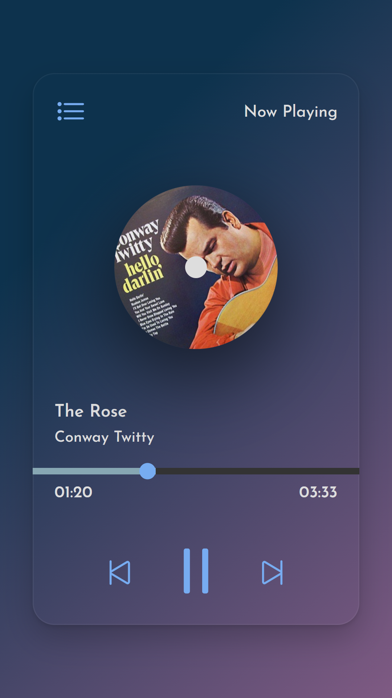
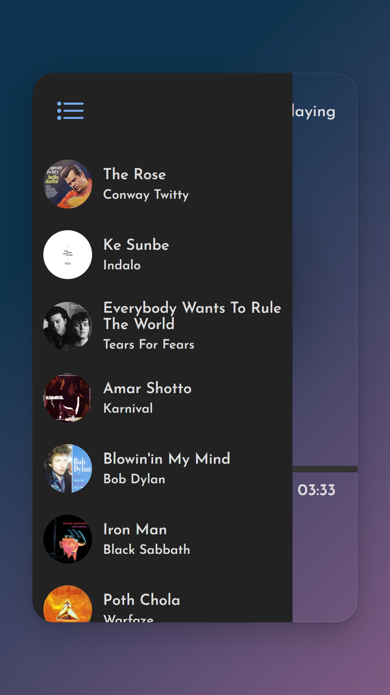
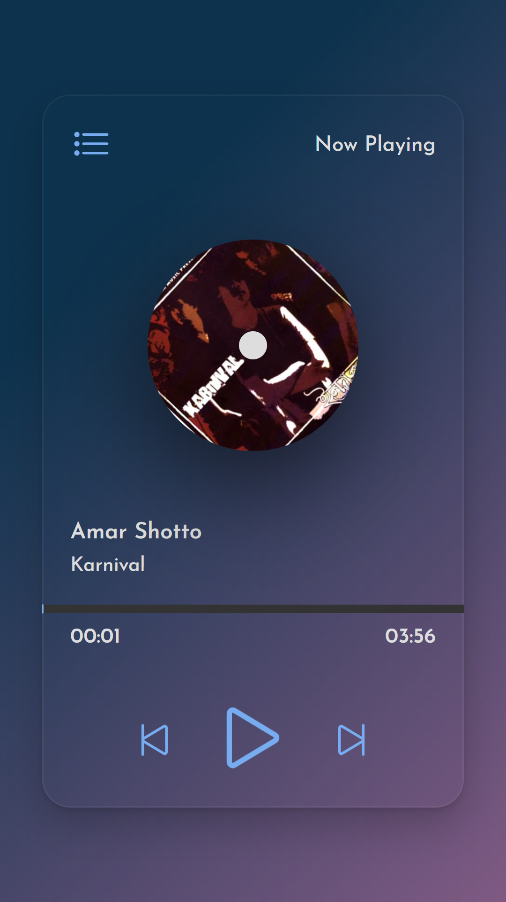

# Welcome

## I created music player simple app using HTML, CSS, Vanilla JS. (expecting any feedback)

---

## Live Site URL - [Live Site](https://ed-music-player.netlify.app/)

---

### Some Screenshoot

## Resources

- ### [Brad Traversy](https://www.youtube.com/watch?v=QTHRWGn_sJw&t=881s)

- ### [Timeupdate event](https://developer.mozilla.org/en-US/docs/Web/API/HTMLMediaElement/timeupdate_event)

- ### [Audio Duration](https://stackoverflow.com/questions/11203773/how-can-i-get-the-html5-audios-duration-time)

- ### [Time Format](https://stackoverflow.com/questions/53488118/html5-get-audio-duration-in-0000-format)

- ### [Hide Scroll](https://dev.to/ashwamegh/how-to-hide-scrollbar-from-any-html-element-dae)

## Songs (I used just for the practice purpose)

- ### [The Rose](https://www.youtube.com/watch?v=cO59ITNCxzk)

- ### [Ke Sunbe](https://www.youtube.com/watch?v=Hrjp5lXmkEM)

- ### [Everybody wants to rule the world](https://www.youtube.com/watch?v=aGCdLKXNF3w)

- ### [Amar Shotto](https://www.youtube.com/watch?v=lJ3qZb6DY28)

- ### [Blowin'in my wind](https://www.youtube.com/watch?v=MMFj8uDubsE)

- ### [Iron Man](https://www.youtube.com/watch?v=5s7_WbiR79E)

- ### [Poth Chola](https://www.youtube.com/watch?v=6dFV5QQE0NM)

- ### [Immigrant Song](https://www.youtube.com/watch?v=P3Y8OWkiUts)
